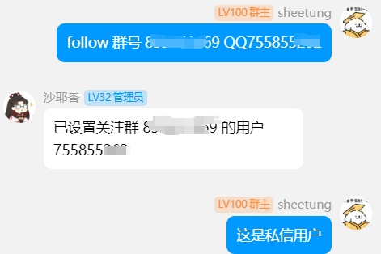

# FollowMsgPlugin

我愿称之为群特工插件，当你被不~~厌~~胜其烦的群消息打扰时，对于直接屏蔽群聊又略显不舍，那么这款插件可以帮你关注群内指定消息，或者关注你的特别关心哦
（其实是dogtencent的VIP功能）

如图




## 安装

配置完成 [LangBot](https://github.com/RockChinQ/LangBot) 主程序后使用管理员账号向机器人发送命令即可安装：

```
!plugin get <你的插件发布仓库地址>
```
或查看详细的[插件安装说明](https://docs.langbot.app/plugin/plugin-intro.html#%E6%8F%92%E4%BB%B6%E7%94%A8%E6%B3%95)

## 使用

<!-- 插件开发者自行填写插件使用说明 -->
懒得写了，根据插件提示使用

使用`/follow help`或者`follow help`触发帮助命令

所有命令均可前缀`/`